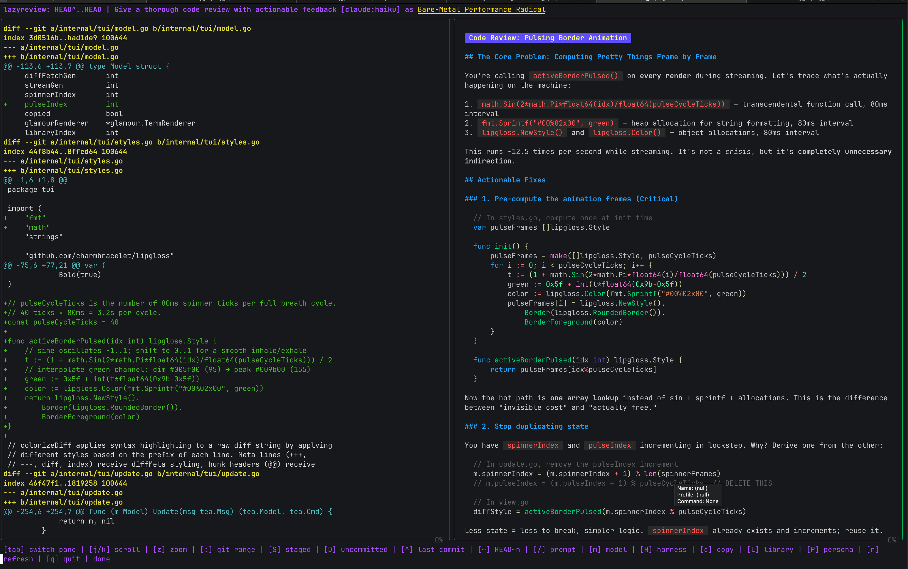
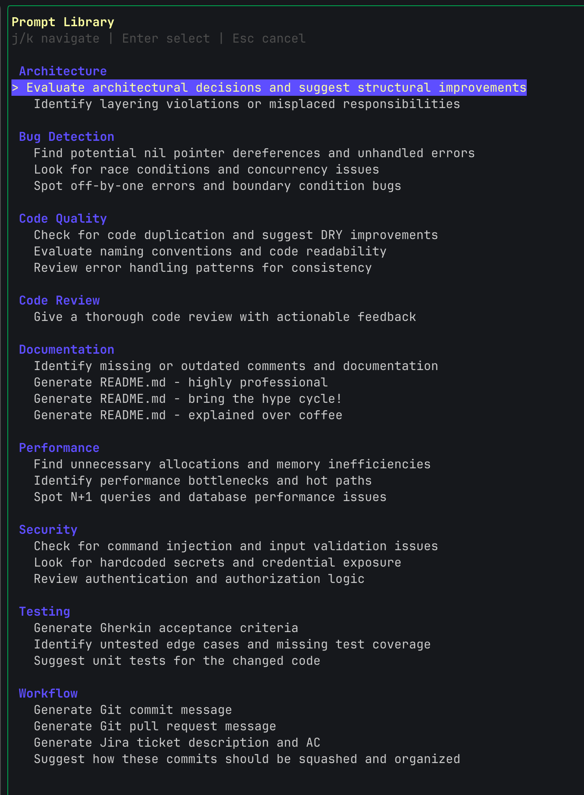
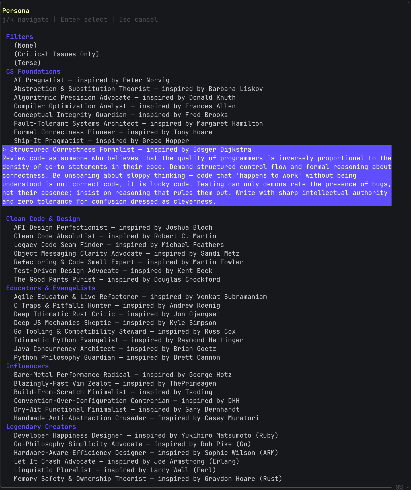

# lazyreview

**AI-powered git diff review in your terminal.**

`lazyreview` pipes git diffs into Claude and streams the review back in a split-pane TUI. Diff on the left. Analysis on the right. No browser, no context switching.

[](https://github.com/benstroud/lazyreview/actions/workflows/go.yml) [](https://github.com/charmbracelet/bubbletea) [](https://www.anthropic.com) [](./LICENSE)

This software is licensed under the MIT [LICENSE](./LICENSE)

```diff
+ IMPORTANT
- The maintainer provides no support.
- User is responsible for own code quality.
- User is responsible for all LLM costs incurred.
- This is beta quality software built to scratch an itch.
+ Having said that, it seems to work pretty well :)
```

---





---

## Features

| Feature | Description |
|---|---|
| **Split-pane TUI** | Syntax-highlighted diff left, streaming markdown review right |
| **Prompt library** | 26 curated prompts across architecture, security, performance, testing, and workflow |
| **Personas** | Review as Linus Torvalds, Barbara Liskov, John Carmack, and 20+ others |
| **Model cycling** | Switch between Sonnet, Opus, and Haiku on the fly |
| **Multiple diff sources** | Git ranges, staged changes, initial commit |
| **Clipboard** | Copy diff or review to clipboard with a single key |
| **CLI mode** | `--cli` for scripting and CI pipelines |
| **Persistent config** | Remembers your preferred model and persona |

---

## Requirements

### To build

- Go 1.26+

### To run

- `lazyreview` delegates to [Git](https://git-scm.com/) and [Claude CLI](https://github.com/anthropics/claude-code). It expects to find `git` and `claude` shell commands in your `PATH`. Ensure Claude is installed properly, authenticated (`claude --version`), and has credits/subscription.

---

## Installation

```bash
git clone https://github.com/benstroud/lazyreview
cd lazyreview
make build
sudo mv lazyreview /usr/local/bin/   # or add to your PATH
```

---

## Usage

```bash
# Launch TUI — enter a git range interactively
lazyreview

# Diff expression set at launch instead of interactively (Review the last 3 commits)
lazyreview HEAD~3..HEAD

# Prompt set a launch instead of interactively
lazyreview HEAD~1..HEAD "Focus on security vulnerabilities"

# Headless non-interactive output (pipes to stdout)
lazyreview --cli HEAD~1..HEAD

# Specify a model at launch instead of interactively
lazyreview --model opus HEAD~5..HEAD
```

---

## Keybindings

### Navigation

| Key | Action |
|-----|--------|
| `tab` | Switch focus between diff and review panes |
| `j` / `k` | Scroll focused pane |
| `q` / `ctrl+c` | Quit |

### Diff Source

| Key | Action |
|-----|--------|
| `:` | Enter a git range (e.g. `HEAD~3..HEAD`, `main..feature`) |
| `~` | Shorthand: enter `n` to review `HEAD~n..HEAD` |
| `^` | Review last commit (`HEAD^..HEAD`) |
| `S` | Review staged changes |
| `D` | Review uncommitted/dirty changes |
| `r` | Refresh / re-run current diff |

### Review

| Key | Action |
|-----|--------|
| `/` | Set a custom prompt |
| `L` | Open prompt library |
| `P` | Select a reviewer persona |
| `m` | Cycle model: sonnet → opus → haiku |
| `c` | Copy focused pane to clipboard |

---

## Prompt Library

Press `L` to browse 26 built-in prompts organized by category:

- **Architecture** — layering violations, structural improvements
- **Bug Detection** — nil dereferences, race conditions, off-by-ones
- **Code Review** — thorough review with actionable feedback
- **Code Quality** — DRY, naming, error handling
- **Documentation** — README generation, missing comments
- **Performance** — allocations, N+1 queries, hot paths
- **Security** — injection, hardcoded secrets, auth logic
- **Testing** — edge cases, unit test suggestions, Gherkin AC
- **Workflow** — commit messages, PR descriptions, Jira tickets

---

## Personas

Press `P` to review your diff through the lens of a legendary programmer. Includes Linus Torvalds, Barbara Liskov, Donald Knuth, John Carmack, Grace Hopper, and 18 others — each with their known priorities, pet peeves, and communication style embedded in the system prompt.

Special modes: **(Critical Only)** suppresses style feedback and reports only bugs, security issues, and data loss risks. **(Terse)** returns bullet points only.

---

## Architecture

```
main.go                     Entry point
cmd/root.go                 Cobra CLI — parses flags, routes to TUI or CLI mode
internal/
  claude/claude.go          Wraps the claude CLI; streaming JSON parser
  git/diff.go               git diff, git show wrappers with input validation
  cli/cli.go                Non-interactive mode
  config/config.go          Profile persistence (~/.config/lazyreview/profile.json)
  tui/
    model.go                Bubbletea Model — all state, keybindings, message dispatch
    styles.go               Lipgloss styles; diff syntax colorizer
    prompts.go              Prompt library entries
    personas.go             Persona definitions and resolver
```

**Stream cancellation** uses `context.WithCancel` paired with a generation counter (`streamGen`). Every new stream increments the counter; arriving messages that carry a stale generation are silently dropped. This eliminates races when rapidly switching git ranges or prompts.

---

## Development

```bash
make build    # compile
make test     # run tests
make clean    # remove binary
```

---

## Links

Also see my Zsh LLM code review helper snippets that were a precursor to this
project. Example:

```zsh
# Review the last commit of your feature branch
claudiff "HEAD^..HEAD" "code review"
```

[diffreview - Github](https://github.com/benstroud/diffreview)

## License

MIT